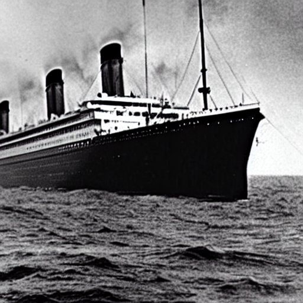

# Titanic Analysis

Building pipelines (https://scikit-learn.org/stable/modules/compose.html)

## Background

The titanic dataset is one of the most widely used sources for data science bootcamps, courses and competitions. There are good reasons for this; the data is freely available, the context is well known and the goal (to predict if a passenger survived based on their age, gender etc.) is easily understood. Moreover there are clear correlations between passenger data and survival that can be intuited. There are some limitations that we shall discuss at the end of the book, but the influence of the dataset is almost unparalleled, with more than 14,000 teams contributing solutions on [Kaggle](https://www.kaggle.com/competitions/titanic) and numerous blog posts, summary articles and youtube videos across the internet.

When reading articles on how to analyse the titanic dataset, I discovered that many were illuminating and picked up on subtle ideas related to missing data (Chapter 2) and over-parameterization (Chapter 3). However, in other cases, I found myself disagreeing with assumptions or curious about the outcome if one were to take an alternative interpretation. This is not unsuprising as any project involves some subjective decisions and, as scientists, we can always test if doing something different leads to a better outcome.

This repository is thus my attempt to do something different - to bring together the valuable insights others have noted with a deeper dive into the dataset. Along the way, I hope to justify my approaches, highlight and test assumptions and show the working that underlies my solution. If successful, the reader will gain a broader understanding of the factors that influenced passenger survival in the specific instance of the Titanic disaster, but hopefully also an appreciation for the value of critical thinking.

**What this repository is not**
This repo is not an introductory explanation for those new to data science or coding - it assumes a general familiarity with Python (or in a future release, R) as well as how to use packages such as pandas, scikit-learn, statsmodels etc. We will discuss specific functions where relevant and it is my goal to highlight concepts rather than implementation within the documentation, so that a reader without technical knowledge may find something useful. However, I won't be explaining how to install virtual environments or manage packages.

## Contents

1. Understanding the data
2. Imputing missing values

At the end of chapters 1-3, we will save a modified version of the training and test data after initial feature engineering (Chapter 1), imputation of missing data (Chapter 2) and advanced feature engineering (Chapter 3). Each modified dataset will allow us to begin the next chapter without repeating the previous steps.

In Chapters 4 onwards, we will produce predictions for testing on Kaggle. 

### Dummy response

The Kaggle competition sets a pretty high baseline by just using passenger's gender to predict survival (performance ~ 74%). This model predicts that women surive and men perished in the disaster. To improve on the performance, we should start by asking
- why did some men survive?
- why did some women not survive?

Following these threads will help us begin to unravel the story, produce new leads and new questions that build a more complex picture of a dataset with meaning, but also gaps. Our role as data scientists is to recognise that meaning and develop the intuition to accurately bridge those gaps, ultimately leading to our ability to predict the surival outcomes for nearly all passengers (hopefully!)

